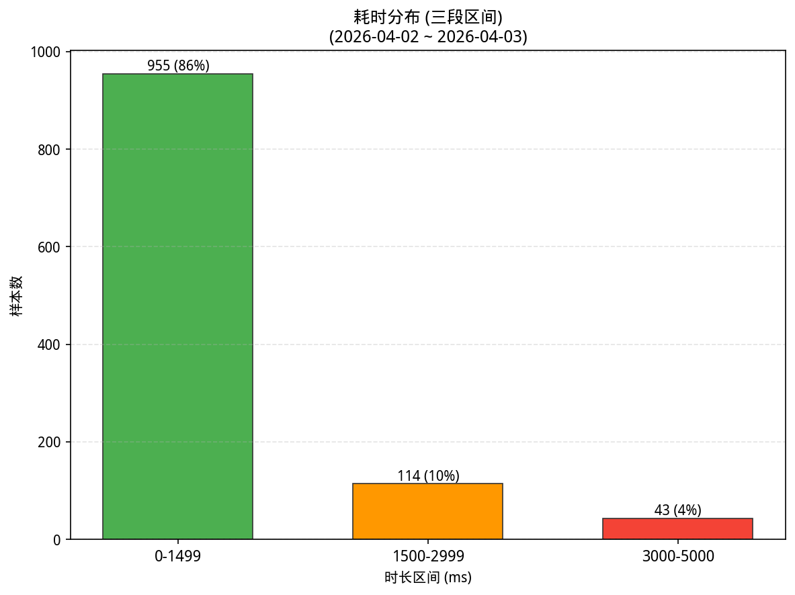
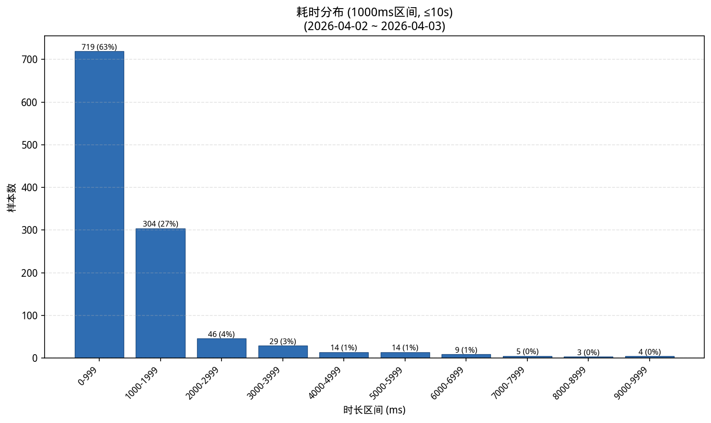
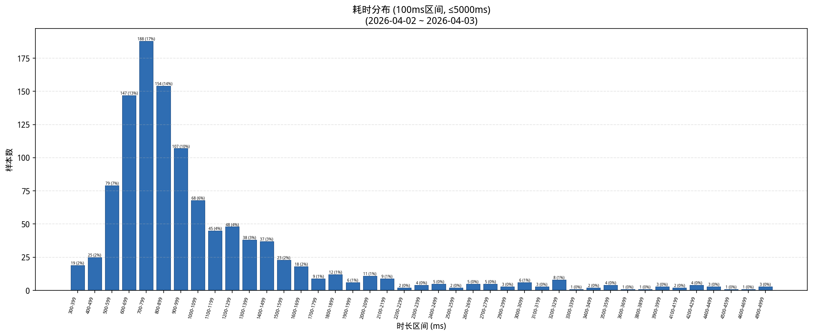

# 自动补全耗时分析报告

## 整体概览

- 样本总数: 1161
- 慢补全阈值: 3000 ms
- 慢补全样本数: 92 (7.9%)
- 平均耗时: 1692.5 ms
- 中位数耗时 (P50): 875.0 ms
- P95 耗时: 4244.0 ms
- P99 耗时: 10173.4 ms

## 因素重要性（eta² 效应量，全量数据）

以下基于 **全量数据**（所有时长），非仅慢补全。eta² 使用 log(1 + time) 作为目标变量，比直接比较原始均值更稳健。eta² ∈ [0, 1]，值越大说明该因素对耗时差异的解释力越强（>0.14 大效应，0.06~0.14 中效应，0.01~0.06 小效应）。

| 因素 | eta² | 最慢分组 | 样本数 | 分组中位数(ms) |
| --- | --- | --- | --- | --- |
| username | 0.217 | jiexiao0750 | 26 | 4822.0 |
| hostname | 0.217 | CTX-W10-200G074 | 26 | 4822.0 |
| region | 0.041 | rjy | 37 | 1348 |
| os | 0.003 | linux | 272 | 924.5 |
| ide | 0.000 | vscode | 574 | 944.5 |
| modelname | 0.000 | Qwen3-Coder-30B-A3B-Instruct | 1161 | 875 |

### username

| 分组 | 样本数 | 均值(ms) | 中位数(ms) | P95(ms) |
| --- | --- | --- | --- | --- |
| jiexiao0750 | 26 | 5295.6 | 4822.0 | 9385.5 |
| lpzhang | 13 | 2093.1 | 2092 | 3536.6 |
| administrator | 5 | 1328.6 | 1346 | 1422.8 |
| jiaogp0779 | 36 | 8086.8 | 1337.5 | 36216.2 |
| lingyy | 22 | 1663.7 | 1288.5 | 3042.3 |
| chenty | 6 | 1747.2 | 1245.0 | 3650.8 |
| sunzq0877 | 127 | 1411.4 | 1206 | 2247.1 |
| jugq0907 | 58 | 1280.8 | 1175.5 | 2173.1 |
| fengqi | 7 | 1159.3 | 1016 | 1466.0 |
| yangyz | 28 | 1022.5 | 1001.0 | 1441.4 |
| lizq | 18 | 1292.3 | 997.5 | 2868.7 |
| zhufq | 29 | 1473.1 | 911 | 5094.2 |
| sunyq | 32 | 1338.6 | 894.5 | 3555.4 |
| weiming | 81 | 974.9 | 861 | 2034 |
| caoyg0759 | 38 | 1115.8 | 861.0 | 3027.0 |
| wangzepeng | 117 | 1045.8 | 812 | 2705.0 |
| shencq | 27 | 844.7 | 802 | 1299.4 |
| lubin | 400 | 1237.2 | 779.0 | 4613.9 |
| qujj | 5 | 6301.4 | 664 | 23604.0 |
| chenyang | 74 | 1168.0 | 657.5 | 3117.2 |

### hostname

| 分组 | 样本数 | 均值(ms) | 中位数(ms) | P95(ms) |
| --- | --- | --- | --- | --- |
| CTX-W10-200G074 | 26 | 5295.6 | 4822.0 | 9385.5 |
| CTX-W10-100G120 | 13 | 2093.1 | 2092 | 3536.6 |
| CHINAMI-4L5I83G | 5 | 1328.6 | 1346 | 1422.8 |
| rjy-td7048 | 36 | 8086.8 | 1337.5 | 36216.2 |
| CTX-W10-100G393 | 22 | 1663.7 | 1288.5 | 3042.3 |
| CTX-Win-VDI146 | 6 | 1747.2 | 1245.0 | 3650.8 |
| CTX-W10-100G373 | 127 | 1411.4 | 1206 | 2247.1 |
| jn-jugq | 58 | 1280.8 | 1175.5 | 2173.1 |
| sh-fengqi | 7 | 1159.3 | 1016 | 1466.0 |
| CTX-W10-100G282 | 28 | 1022.5 | 1001.0 | 1441.4 |
| CTX-W10-100G392 | 18 | 1292.3 | 997.5 | 2868.7 |
| CTX-Win-VDI271 | 29 | 1473.1 | 911 | 5094.2 |
| CTX-W10-100G430 | 32 | 1338.6 | 894.5 | 3555.4 |
| CTX-W10-100G287 | 81 | 974.9 | 861 | 2034 |
| sh-caoyg | 38 | 1115.8 | 861.0 | 3027.0 |
| sh-wangzepeng | 117 | 1045.8 | 812 | 2705.0 |
| CTX-W10-100G288 | 27 | 844.7 | 802 | 1299.4 |
| CTX-Win-VDI162 | 400 | 1237.2 | 779.0 | 4613.9 |
| gz-qujj | 5 | 6301.4 | 664 | 23604.0 |
| CTX-W10-100G030 | 74 | 1168.0 | 657.5 | 3117.2 |

### region

| 分组 | 样本数 | 均值(ms) | 中位数(ms) | P95(ms) |
| --- | --- | --- | --- | --- |
| rjy | 37 | 12247.3 | 1348 | 85933.8 |
| jn | 957 | 1389.1 | 877 | 4281.6 |
| sh | 164 | 1073.9 | 833.5 | 2882.5 |

## 数值因素相关性（全量数据）

| 因素 | 样本数 | Pearson(log_time) | Spearman(time) |
| --- | --- | --- | --- |
| user_request_count | 1161 | -0.155 | -0.236 |
| pid_relative_in_host | 446 | -0.038 | -0.052 |
| hourly_bucket_count | 1161 | 0.009 | -0.025 |
| pid | 1161 | -0.035 | 0.013 |

## 耗时分布（全量数据）

| 时长区间(ms) | 样本数 | 占比 | 累计样本数 | 累计占比 |
| --- | --- | --- | --- | --- |
| 300-399 | 19 | 0.016 | 19 | 0.016 |
| 400-499 | 25 | 0.022 | 44 | 0.038 |
| 500-599 | 79 | 0.068 | 123 | 0.106 |
| 600-699 | 147 | 0.127 | 270 | 0.233 |
| 700-799 | 188 | 0.162 | 458 | 0.394 |
| 800-899 | 154 | 0.133 | 612 | 0.527 |
| 900-999 | 107 | 0.092 | 719 | 0.619 |
| 1000-1099 | 68 | 0.059 | 787 | 0.678 |
| 1100-1199 | 45 | 0.039 | 832 | 0.717 |
| 1200-1299 | 48 | 0.041 | 880 | 0.758 |
| 1300-1399 | 38 | 0.033 | 918 | 0.791 |
| 1400-1499 | 37 | 0.032 | 955 | 0.823 |
| 1500-1599 | 23 | 0.020 | 978 | 0.842 |
| 1600-1699 | 18 | 0.016 | 996 | 0.858 |
| 1700-1799 | 9 | 0.008 | 1005 | 0.866 |
| 1800-1899 | 12 | 0.010 | 1017 | 0.876 |
| 1900-1999 | 6 | 0.005 | 1023 | 0.881 |
| 2000-2099 | 11 | 0.009 | 1034 | 0.891 |
| 2100-2199 | 9 | 0.008 | 1043 | 0.898 |
| 2200-2299 | 2 | 0.002 | 1045 | 0.900 |
| 2300-2399 | 4 | 0.003 | 1049 | 0.904 |
| 2400-2499 | 5 | 0.004 | 1054 | 0.908 |
| 2500-2599 | 2 | 0.002 | 1056 | 0.910 |
| 2600-2699 | 5 | 0.004 | 1061 | 0.914 |
| 2700-2799 | 5 | 0.004 | 1066 | 0.918 |
| 2900-2999 | 3 | 0.003 | 1069 | 0.921 |
| 3000-3099 | 6 | 0.005 | 1075 | 0.926 |
| 3100-3199 | 3 | 0.003 | 1078 | 0.929 |
| 3200-3299 | 8 | 0.007 | 1086 | 0.935 |
| 3300-3399 | 1 | 0.001 | 1087 | 0.936 |
| 3400-3499 | 2 | 0.002 | 1089 | 0.938 |
| 3500-3599 | 4 | 0.003 | 1093 | 0.941 |
| 3600-3699 | 1 | 0.001 | 1094 | 0.942 |
| 3800-3899 | 1 | 0.001 | 1095 | 0.943 |
| 3900-3999 | 3 | 0.003 | 1098 | 0.946 |
| 4000-4999 | 14 | 0.012 | 1112 | 0.958 |
| 5000-5999 | 14 | 0.012 | 1126 | 0.970 |
| 6000-6999 | 9 | 0.008 | 1135 | 0.978 |
| 7000-7999 | 5 | 0.004 | 1140 | 0.982 |
| 8000-8999 | 3 | 0.003 | 1143 | 0.984 |
| 9000-9999 | 4 | 0.003 | 1147 | 0.988 |
| 10000-10999 | 5 | 0.004 | 1152 | 0.992 |
| 12000-12999 | 2 | 0.002 | 1154 | 0.994 |
| 13000-13999 | 1 | 0.001 | 1155 | 0.995 |
| 14000-14999 | 1 | 0.001 | 1156 | 0.996 |
| 23000-23999 | 1 | 0.001 | 1157 | 0.997 |
| 29000-29999 | 1 | 0.001 | 1158 | 0.997 |
| 74000-74999 | 1 | 0.001 | 1159 | 0.998 |
| 133000-133999 | 1 | 0.001 | 1160 | 0.999 |
| 162000-162999 | 1 | 0.001 | 1161 | 1.000 |

## 慢补全按小时分布（长尾分析，仅慢补全数据）

以下仅统计 **慢补全**（≥3000ms）样本。按一天中的小时 (00:00~23:00) 跨天聚合，用于识别慢请求集中的高峰时段。

| 小时 | 慢补全数 | 慢补全占比 | 均值(ms) | 中位数(ms) |
| --- | --- | --- | --- | --- |
| 09:00 | 10 | 0.109 | 5900.6 | 5257.0 |
| 10:00 | 18 | 0.196 | 5891.1 | 5478.0 |
| 11:00 | 3 | 0.033 | 7853.3 | 5968 |
| 13:00 | 14 | 0.152 | 5275.6 | 4715.0 |
| 14:00 | 24 | 0.261 | 5693.9 | 5209.5 |
| 15:00 | 4 | 0.043 | 6783.5 | 6867.0 |
| 16:00 | 13 | 0.141 | 27461.7 | 4241 |
| 17:00 | 6 | 0.065 | 23322.7 | 14750.5 |

## 按小时整体统计（全量数据）

以下基于 **全量数据**。按一天中的小时 (00:00~23:00) 跨天聚合所有补全请求，分析各时段的请求量和慢补全比例。

| 小时 | 样本数 | 均值(ms) | 中位数(ms) | 慢补全数 | 慢补全率 |
| --- | --- | --- | --- | --- | --- |
| 08:00 | 10 | 988.6 | 831.5 | 0 | 0.000 |
| 09:00 | 65 | 1752.6 | 986 | 10 | 0.154 |
| 10:00 | 165 | 1466.3 | 843 | 18 | 0.109 |
| 11:00 | 92 | 1128.8 | 812.5 | 3 | 0.033 |
| 13:00 | 127 | 1453.2 | 916 | 14 | 0.110 |
| 14:00 | 229 | 1444.8 | 877 | 24 | 0.105 |
| 15:00 | 129 | 1171.3 | 884 | 4 | 0.031 |
| 16:00 | 190 | 2794.6 | 858.0 | 13 | 0.068 |
| 17:00 | 85 | 2693.0 | 1012 | 6 | 0.071 |
| 18:00 | 24 | 1027.0 | 911.0 | 0 | 0.000 |
| 19:00 | 37 | 934.4 | 773 | 0 | 0.000 |
| 20:00 | 5 | 1211.2 | 1249 | 0 | 0.000 |

## 慢补全过度出现分析（基于全量数据计算慢率）

以下基于 **全量数据** 计算各组慢率（≥3000ms）。lift = 该组慢率 / 全局基线慢率。lift > 1 表示该组慢补全比例高于平均水平，值越大问题越集中。

### ide

| 分组 | 样本数 | 慢补全数 | 慢补全率 | lift(倍数) |
| --- | --- | --- | --- | --- |
| pycharm | 537 | 62 | 0.115 | 1.457 |
| unknown | 50 | 3 | 0.060 | 0.757 |
| vscode | 574 | 27 | 0.047 | 0.594 |

### os

| 分组 | 样本数 | 慢补全数 | 慢补全率 | lift(倍数) |
| --- | --- | --- | --- | --- |
| windows | 889 | 75 | 0.084 | 1.065 |
| linux | 272 | 17 | 0.062 | 0.789 |

### region

| 分组 | 样本数 | 慢补全数 | 慢补全率 | lift(倍数) |
| --- | --- | --- | --- | --- |
| rjy | 37 | 6 | 0.162 | 2.046 |
| jn | 957 | 78 | 0.082 | 1.029 |
| sh | 164 | 8 | 0.049 | 0.616 |

### username

| 分组 | 样本数 | 慢补全数 | 慢补全率 | lift(倍数) |
| --- | --- | --- | --- | --- |
| jiexiao0750 | 26 | 22 | 0.846 | 10.678 |
| qujj | 5 | 1 | 0.200 | 2.524 |
| chenty | 6 | 1 | 0.167 | 2.103 |
| lpzhang | 13 | 2 | 0.154 | 1.941 |
| jiaogp0779 | 36 | 5 | 0.139 | 1.753 |
| lingyy | 22 | 3 | 0.136 | 1.721 |
| zhufq | 29 | 3 | 0.103 | 1.305 |
| lubin | 400 | 29 | 0.072 | 0.915 |
| chenyang | 74 | 5 | 0.068 | 0.853 |
| sunyq | 32 | 2 | 0.062 | 0.789 |
| lizq | 18 | 1 | 0.056 | 0.701 |
| caoyg0759 | 38 | 2 | 0.053 | 0.664 |
| wangzepeng | 117 | 6 | 0.051 | 0.647 |
| sunzq0877 | 127 | 5 | 0.039 | 0.497 |
| jugq0907 | 58 | 2 | 0.034 | 0.435 |
| weiming | 81 | 2 | 0.025 | 0.312 |

### ide + os

| 分组 | 样本数 | 慢补全数 | 慢补全率 | lift(倍数) |
| --- | --- | --- | --- | --- |
| pycharm / linux | 37 | 6 | 0.162 | 2.046 |
| pycharm / windows | 500 | 56 | 0.112 | 1.413 |
| unknown / linux | 50 | 3 | 0.060 | 0.757 |
| vscode / windows | 389 | 19 | 0.049 | 0.616 |
| vscode / linux | 185 | 8 | 0.043 | 0.546 |

### ide + region

| 分组 | 样本数 | 慢补全数 | 慢补全率 | lift(倍数) |
| --- | --- | --- | --- | --- |
| unknown / jn | 5 | 1 | 0.200 | 2.524 |
| pycharm / rjy | 37 | 6 | 0.162 | 2.046 |
| pycharm / jn | 500 | 56 | 0.112 | 1.413 |
| vscode / sh | 119 | 6 | 0.050 | 0.636 |
| vscode / jn | 452 | 21 | 0.046 | 0.586 |
| unknown / sh | 45 | 2 | 0.044 | 0.561 |

## 用户维度汇总（全量数据）

| 用户名 | 样本数 | 占比 | 均值(ms) | 中位数(ms) | P95(ms) | 慢补全率 |
| --- | --- | --- | --- | --- | --- | --- |
| jiexiao0750 | 26 | 0.022 | 5295.6 | 4822.0 | 9385.5 | 0.846 |
| qujj | 5 | 0.004 | 6301.4 | 664 | 23604.0 | 0.200 |
| chenty | 6 | 0.005 | 1747.2 | 1245.0 | 3650.8 | 0.167 |
| lpzhang | 13 | 0.011 | 2093.1 | 2092 | 3536.6 | 0.154 |
| jiaogp0779 | 36 | 0.031 | 8086.8 | 1337.5 | 36216.2 | 0.139 |
| lingyy | 22 | 0.019 | 1663.7 | 1288.5 | 3042.3 | 0.136 |
| zhufq | 29 | 0.025 | 1473.1 | 911 | 5094.2 | 0.103 |
| lubin | 400 | 0.345 | 1237.2 | 779.0 | 4613.9 | 0.072 |
| chenyang | 74 | 0.064 | 1168.0 | 657.5 | 3117.2 | 0.068 |
| sunyq | 32 | 0.028 | 1338.6 | 894.5 | 3555.4 | 0.062 |
| lizq | 18 | 0.016 | 1292.3 | 997.5 | 2868.7 | 0.056 |
| caoyg0759 | 38 | 0.033 | 1115.8 | 861.0 | 3027.0 | 0.053 |
| wangzepeng | 117 | 0.101 | 1045.8 | 812 | 2705.0 | 0.051 |
| sunzq0877 | 127 | 0.109 | 1411.4 | 1206 | 2247.1 | 0.039 |
| jugq0907 | 58 | 0.050 | 1280.8 | 1175.5 | 2173.1 | 0.034 |
| weiming | 81 | 0.070 | 974.9 | 861 | 2034 | 0.025 |
| administrator | 5 | 0.004 | 1328.6 | 1346 | 1422.8 | 0.000 |
| fengqi | 7 | 0.006 | 1159.3 | 1016 | 1466.0 | 0.000 |
| yangyz | 28 | 0.024 | 1022.5 | 1001.0 | 1441.4 | 0.000 |
| shencq | 27 | 0.023 | 844.7 | 802 | 1299.4 | 0.000 |

## 频率-时长关联分析（全量数据）

以下基于 **全量数据**。Spearman 相关系数衡量请求频率与耗时/慢率的单调关联。正值表示高频时段（或用户）倾向更慢，可能存在负载瓶颈。仅为关联，不代表因果。

| 范围 | 桶数 | Spearman(频率,均值) | Spearman(频率,慢率) |
| --- | --- | --- | --- |
| 小时桶 | 16 | 0.312 | 0.559 |

| 范围 | 用户组数 | Spearman(频率,均值) | Spearman(频率,慢率) |
| --- | --- | --- | --- |
| 用户 | 20 | -0.402 | -0.192 |

## 最慢样本明细（全量数据 Top 20）

| 时间戳 | 用户名 | 主机名 | IDE | 操作系统 | 地域 | PID | 耗时(ms) |
| --- | --- | --- | --- | --- | --- | --- | --- |
| 2026-04-02T16:55:50.254348 | wangyue | rjy-td7043 | pycharm | linux | rjy | 16606 | 162026 |
| 2026-04-02T16:44:41.140314 | jiaogp0779 | rjy-td7048 | pycharm | linux | rjy | 12134 | 133481 |
| 2026-04-02T17:08:09.615236 | jiaogp0779 | rjy-td7048 | pycharm | linux | rjy | 12134 | 74047 |
| 2026-04-02T17:49:31.946262 | qujj | gz-qujj | unknown | linux | jn | 8331 | 29312 |
| 2026-04-02T17:06:01.853285 | jiaogp0779 | rjy-td7048 | pycharm | linux | rjy | 12134 | 23606 |
| 2026-04-02T11:28:25.450998 | sunzq0877 | CTX-W10-100G373 | vscode | windows | jn | 29184 | 14326 |
| 2026-04-02T16:44:51.155595 | jiaogp0779 | rjy-td7048 | pycharm | linux | rjy | 12134 | 13758 |
| 2026-04-02T09:41:37.222023 | jiexiao0750 | CTX-W10-200G074 | pycharm | windows | jn | 19172 | 12477 |
| 2026-04-02T16:38:10.581053 | lubin | CTX-Win-VDI162 | pycharm | windows | jn | 14104 | 12121 |
| 2026-04-02T13:35:17.481726 | lubin | CTX-Win-VDI162 | pycharm | windows | jn | 14104 | 10338 |
| 2026-04-02T10:17:05.935812 | lubin | CTX-Win-VDI162 | pycharm | windows | jn | 14104 | 10251 |
| 2026-04-02T10:04:33.559861 | chenyang | CTX-W10-100G030 | pycharm | windows | jn | 60364 | 10177 |
| 2026-04-02T15:25:01.008382 | sunyq | CTX-W10-100G430 | vscode | windows | jn | 14852 | 10171 |
| 2026-04-02T14:00:29.133959 | zhufq | CTX-Win-VDI271 | vscode | windows | jn | 47524 | 10129 |
| 2026-04-02T14:46:49.817240 | lubin | CTX-Win-VDI162 | pycharm | windows | jn | 14104 | 9680 |
| 2026-04-02T14:39:47.403703 | jiexiao0750 | CTX-W10-200G074 | pycharm | windows | jn | 19172 | 9666 |
| 2026-04-02T10:07:20.166935 | chenyang | CTX-W10-100G030 | pycharm | windows | jn | 60364 | 9214 |
| 2026-04-02T10:05:24.893544 | chenyang | CTX-W10-100G030 | pycharm | windows | jn | 60364 | 9182 |
| 2026-04-02T14:09:28.210609 | jiexiao0750 | CTX-W10-200G074 | pycharm | windows | jn | 19172 | 8544 |
| 2026-04-02T10:56:03.791278 | lubin | CTX-Win-VDI162 | pycharm | windows | jn | 14104 | 8106 |

## 说明

- 只分析 time 字段（补全总耗时），其他 debug_ms 字段不参与任何结论。
- 慢补全 / 长尾的阈值统一为 ≥3000ms。
- region 通过 hostname 是否包含 bj、jn、sh、rjy 判断；若都不包含，默认记为 jn。
- hostname 中按分隔符边界匹配 win、w10、w11（大小写不敏感）判为 windows，其余统一判为 linux。
- 按小时统计均为跨天聚合（按一天中的 0~23 时），用于识别高峰时段而非具体日期。
- PID 绝对值跨机器不可直接比较，脚本额外计算了 pid_relative_in_host（同主机内归一化到 [0,1]），用于观察进程生命周期与耗时的关系。
- 频率-时长关联仅表示统计关联，不代表因果。若要做因果分析，需额外控制用户、主机、时间段等混杂因素。
