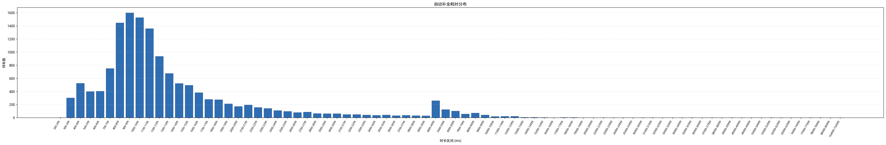

# 自动补全耗时分析报告

## 整体概览

- 样本总数: 14453
- 慢补全阈值: 3000 ms
- 慢补全样本数: 1191 (8.2%)
- 平均耗时: 1643.2 ms
- 中位数耗时 (P50): 1117.0 ms
- P95 耗时: 4173.4 ms
- P99 耗时: 9535.4 ms

## 因素重要性（eta² 效应量，全量数据）

以下基于 **全量数据**（所有时长），非仅慢补全。eta² 使用 log(1 + time) 作为目标变量，比直接比较原始均值更稳健。eta² ∈ [0, 1]，值越大说明该因素对耗时差异的解释力越强（>0.14 大效应，0.06~0.14 中效应，0.01~0.06 小效应）。

| 因素      | eta²  | 最慢分组                     | 样本数 | 分组中位数(ms) |
| --------- | ----- | ---------------------------- | ------ | -------------- |
| username  | 0.167 | weilj                        | 8      | 3554.5         |
| hostname  | 0.167 | CTX-W10-100G035              | 8      | 3554.5         |
| region    | 0.013 | rjy                          | 294    | 1343.5         |
| ide       | 0.003 | unknown                      | 725    | 1132           |
| os        | 0.002 | linux                        | 2550   | 1126.5         |
| modelname | 0.000 | Qwen3-Coder-30B-A3B-Instruct | 14451  | 1117           |

### username

| 分组          | 样本数 | 均值(ms) | 中位数(ms) | P95(ms) |
| ------------- | ------ | -------- | ---------- | ------- |
| weilj         | 8      | 10179.8  | 3554.5     | 27914.3 |
| qiuqs0880     | 48     | 2704.8   | 1912.5     | 6568.2  |
| jiexiao0750   | 1539   | 2420.3   | 1911       | 5497.7  |
| songyu        | 53     | 2122.4   | 1517       | 5333.0  |
| lizq          | 720    | 1952.4   | 1484.5     | 6245.0  |
| wangyue       | 231    | 5904.1   | 1418       | 35007.0 |
| sunzq0877     | 797    | 1739.7   | 1406       | 3539.4  |
| chenbl        | 31     | 1463.7   | 1348       | 2393.0  |
| lingyy        | 671    | 1546.3   | 1344       | 3088.5  |
| fengqi        | 191    | 2371.1   | 1315       | 7115.5  |
| shencq        | 232    | 1476.9   | 1272.5     | 2872.5  |
| yangyz        | 1027   | 1312.0   | 1186       | 2512.5  |
| jugq0907      | 461    | 1991.5   | 1186       | 6402    |
| zhufq         | 96     | 1399.2   | 1121.5     | 2529.0  |
| administrator | 293    | 1425.9   | 1109       | 2526.8  |
| lubin         | 1295   | 1736.9   | 1098       | 5393.2  |
| wangzepeng    | 408    | 1511.9   | 1093.0     | 3211.4  |
| lpzhang       | 79     | 1619.0   | 1092       | 4445.1  |
| pda           | 515    | 1124.6   | 1080       | 1657.7  |
| wujy          | 98     | 1478.5   | 1057.0     | 4512.7  |

### hostname

| 分组            | 样本数 | 均值(ms) | 中位数(ms) | P95(ms) |
| --------------- | ------ | -------- | ---------- | ------- |
| CTX-W10-100G035 | 8      | 10179.8  | 3554.5     | 27914.3 |
| sh-qiuqs        | 48     | 2704.8   | 1912.5     | 6568.2  |
| CTX-W10-200G074 | 1539   | 2420.3   | 1911       | 5497.7  |
| CTX-Win-VDI207  | 53     | 2122.4   | 1517       | 5333.0  |
| CTX-W10-100G392 | 720    | 1952.4   | 1484.5     | 6245.0  |
| rjy-td7043      | 231    | 5904.1   | 1418       | 35007.0 |
| CTX-W10-100G373 | 797    | 1739.7   | 1406       | 3539.4  |
| CTX-W10-100G399 | 31     | 1463.7   | 1348       | 2393.0  |
| CTX-W10-100G393 | 671    | 1546.3   | 1344       | 3088.5  |
| sh-fengqi       | 191    | 2371.1   | 1315       | 7115.5  |
| CTX-W10-100G288 | 232    | 1476.9   | 1272.5     | 2872.5  |
| CTX-W10-100G282 | 1027   | 1312.0   | 1186       | 2512.5  |
| jn-jugq         | 461    | 1991.5   | 1186       | 6402    |
| CTX-Win-VDI271  | 96     | 1399.2   | 1121.5     | 2529.0  |
| CHINAMI-4L5I83G | 293    | 1425.9   | 1109       | 2526.8  |
| CTX-Win-VDI162  | 1295   | 1736.9   | 1098       | 5393.2  |
| sh-wangzepeng   | 408    | 1511.9   | 1093.0     | 3211.4  |
| CTX-W10-100G120 | 79     | 1619.0   | 1092       | 4445.1  |
| archlinux       | 515    | 1124.6   | 1080       | 1657.7  |
| gz-wujy         | 98     | 1478.5   | 1057.0     | 4512.7  |

### region

| 分组 | 样本数 | 均值(ms) | 中位数(ms) | P95(ms) |
| ---- | ------ | -------- | ---------- | ------- |
| rjy  | 294    | 5229.4   | 1343.5     | 24874.5 |
| sh   | 648    | 1853.2   | 1169.0     | 4841.4  |
| jn   | 13506  | 1555.3   | 1111.0     | 4059.0  |
| bj   | 5      | 764.2    | 729        | 920.2   |

## 数值因素相关性（全量数据）

| 因素                 | 样本数 | Pearson(log_time) | Spearman(time) |
| -------------------- | ------ | ----------------- | -------------- |
| pid_relative_in_host | 14350  | 0.173             | 0.194          |
| user_request_count   | 14453  | -0.127            | -0.162         |
| hourly_bucket_count  | 14453  | -0.057            | -0.077         |
| pid                  | 14453  | 0.031             | 0.055          |

## 耗时分布（全量数据）

| 时长区间(ms)  | 样本数 | 占比  | 累计样本数 | 累计占比 |
| ------------- | ------ | ----- | ---------- | -------- |
| 200-299       | 2      | 0.000 | 2          | 0.000    |
| 300-399       | 302    | 0.021 | 304        | 0.021    |
| 400-499       | 525    | 0.036 | 829        | 0.057    |
| 500-599       | 399    | 0.028 | 1228       | 0.085    |
| 600-699       | 405    | 0.028 | 1633       | 0.113    |
| 700-799       | 750    | 0.052 | 2383       | 0.165    |
| 800-899       | 1447   | 0.100 | 3830       | 0.265    |
| 900-999       | 1600   | 0.111 | 5430       | 0.376    |
| 1000-1099     | 1526   | 0.106 | 6956       | 0.481    |
| 1100-1199     | 1360   | 0.094 | 8316       | 0.575    |
| 1200-1299     | 936    | 0.065 | 9252       | 0.640    |
| 1300-1399     | 676    | 0.047 | 9928       | 0.687    |
| 1400-1499     | 522    | 0.036 | 10450      | 0.723    |
| 1500-1599     | 496    | 0.034 | 10946      | 0.757    |
| 1600-1699     | 382    | 0.026 | 11328      | 0.784    |
| 1700-1799     | 281    | 0.019 | 11609      | 0.803    |
| 1800-1899     | 275    | 0.019 | 11884      | 0.822    |
| 1900-1999     | 211    | 0.015 | 12095      | 0.837    |
| 2000-2099     | 173    | 0.012 | 12268      | 0.849    |
| 2100-2199     | 194    | 0.013 | 12462      | 0.862    |
| 2200-2299     | 158    | 0.011 | 12620      | 0.873    |
| 2300-2399     | 141    | 0.010 | 12761      | 0.883    |
| 2400-2499     | 110    | 0.008 | 12871      | 0.891    |
| 2500-2599     | 98     | 0.007 | 12969      | 0.897    |
| 2600-2699     | 79     | 0.005 | 13048      | 0.903    |
| 2700-2799     | 87     | 0.006 | 13135      | 0.909    |
| 2800-2899     | 65     | 0.004 | 13200      | 0.913    |
| 2900-2999     | 62     | 0.004 | 13262      | 0.918    |
| 3000-3099     | 62     | 0.004 | 13324      | 0.922    |
| 3100-3199     | 50     | 0.003 | 13374      | 0.925    |
| 3200-3299     | 49     | 0.003 | 13423      | 0.929    |
| 3300-3399     | 43     | 0.003 | 13466      | 0.932    |
| 3400-3499     | 37     | 0.003 | 13503      | 0.934    |
| 3500-3599     | 41     | 0.003 | 13544      | 0.937    |
| 3600-3699     | 32     | 0.002 | 13576      | 0.939    |
| 3700-3799     | 36     | 0.002 | 13612      | 0.942    |
| 3800-3899     | 31     | 0.002 | 13643      | 0.944    |
| 3900-3999     | 29     | 0.002 | 13672      | 0.946    |
| 4000-4999     | 259    | 0.018 | 13931      | 0.964    |
| 5000-5999     | 124    | 0.009 | 14055      | 0.972    |
| 6000-6999     | 102    | 0.007 | 14157      | 0.980    |
| 7000-7999     | 56     | 0.004 | 14213      | 0.983    |
| 8000-8999     | 71     | 0.005 | 14284      | 0.988    |
| 9000-9999     | 42     | 0.003 | 14326      | 0.991    |
| 10000-10999   | 20     | 0.001 | 14346      | 0.993    |
| 11000-11999   | 23     | 0.002 | 14369      | 0.994    |
| 12000-12999   | 23     | 0.002 | 14392      | 0.996    |
| 13000-13999   | 6      | 0.000 | 14398      | 0.996    |
| 14000-14999   | 8      | 0.001 | 14406      | 0.997    |
| 15000-15999   | 4      | 0.000 | 14410      | 0.997    |
| 16000-16999   | 2      | 0.000 | 14412      | 0.997    |
| 17000-17999   | 4      | 0.000 | 14416      | 0.997    |
| 18000-18999   | 4      | 0.000 | 14420      | 0.998    |
| 19000-19999   | 1      | 0.000 | 14421      | 0.998    |
| 20000-20999   | 3      | 0.000 | 14424      | 0.998    |
| 22000-22999   | 1      | 0.000 | 14425      | 0.998    |
| 23000-23999   | 1      | 0.000 | 14426      | 0.998    |
| 24000-24999   | 1      | 0.000 | 14427      | 0.998    |
| 25000-25999   | 1      | 0.000 | 14428      | 0.998    |
| 30000-30999   | 1      | 0.000 | 14429      | 0.998    |
| 31000-31999   | 1      | 0.000 | 14430      | 0.998    |
| 32000-32999   | 2      | 0.000 | 14432      | 0.999    |
| 33000-33999   | 1      | 0.000 | 14433      | 0.999    |
| 34000-34999   | 1      | 0.000 | 14434      | 0.999    |
| 35000-35999   | 1      | 0.000 | 14435      | 0.999    |
| 36000-36999   | 3      | 0.000 | 14438      | 0.999    |
| 37000-37999   | 1      | 0.000 | 14439      | 0.999    |
| 38000-38999   | 1      | 0.000 | 14440      | 0.999    |
| 39000-39999   | 1      | 0.000 | 14441      | 0.999    |
| 40000-40999   | 1      | 0.000 | 14442      | 0.999    |
| 49000-49999   | 1      | 0.000 | 14443      | 0.999    |
| 54000-54999   | 1      | 0.000 | 14444      | 0.999    |
| 55000-55999   | 1      | 0.000 | 14445      | 0.999    |
| 62000-62999   | 1      | 0.000 | 14446      | 1.000    |
| 63000-63999   | 2      | 0.000 | 14448      | 1.000    |
| 74000-74999   | 1      | 0.000 | 14449      | 1.000    |
| 77000-77999   | 1      | 0.000 | 14450      | 1.000    |
| 78000-78999   | 1      | 0.000 | 14451      | 1.000    |
| 80000-80999   | 1      | 0.000 | 14452      | 1.000    |
| 154000-154999 | 1      | 0.000 | 14453      | 1.000    |

## 慢补全按小时分布（长尾分析，仅慢补全数据）

以下仅统计 **慢补全**（≥3000ms）样本。按一天中的小时 (00:00~23:00) 跨天聚合，用于识别慢请求集中的高峰时段。

| 小时  | 慢补全数 | 慢补全占比 | 均值(ms) | 中位数(ms) |
| ----- | -------- | ---------- | -------- | ---------- |
| 00:00 | 6        | 0.005      | 32125.0  | 21693.0    |
| 08:00 | 15       | 0.013      | 20027.5  | 5355       |
| 09:00 | 60       | 0.050      | 6281.1   | 4880.5     |
| 10:00 | 145      | 0.122      | 6563.7   | 4831       |
| 11:00 | 83       | 0.070      | 8034.0   | 4426       |
| 12:00 | 1        | 0.001      | 5453.0   | 5453       |
| 13:00 | 108      | 0.091      | 6992.9   | 4590.5     |
| 14:00 | 182      | 0.153      | 5688.5   | 4513.5     |
| 15:00 | 134      | 0.113      | 6222.0   | 4778.0     |
| 16:00 | 178      | 0.149      | 5300.2   | 4520.5     |
| 17:00 | 171      | 0.144      | 6248.5   | 4422       |
| 18:00 | 62       | 0.052      | 7617.5   | 5272.5     |
| 19:00 | 8        | 0.007      | 7688.0   | 7652.5     |
| 20:00 | 19       | 0.016      | 6678.8   | 6186       |
| 21:00 | 12       | 0.010      | 12205.2  | 4471.5     |
| 22:00 | 4        | 0.003      | 12545.2  | 8061.5     |
| 23:00 | 3        | 0.003      | 3786.3   | 4035       |

## 按小时整体统计（全量数据）

以下基于 **全量数据**。按一天中的小时 (00:00~23:00) 跨天聚合所有补全请求，分析各时段的请求量和慢补全比例。

| 小时  | 样本数 | 均值(ms) | 中位数(ms) | 慢补全数 | 慢补全率 |
| ----- | ------ | -------- | ---------- | -------- | -------- |
| 00:00 | 53     | 4624.0   | 1071       | 6        | 0.113    |
| 07:00 | 7      | 1096.3   | 1048       | 0        | 0.000    |
| 08:00 | 171    | 2912.3   | 1256       | 15       | 0.088    |
| 09:00 | 1021   | 1521.2   | 1164       | 60       | 0.059    |
| 10:00 | 1894   | 1545.4   | 1088.5     | 145      | 0.077    |
| 11:00 | 1001   | 1713.4   | 1072       | 83       | 0.083    |
| 12:00 | 6      | 2099.8   | 1502.5     | 1        | 0.167    |
| 13:00 | 1391   | 1663.8   | 1133       | 108      | 0.078    |
| 14:00 | 2129   | 1552.9   | 1106       | 182      | 0.085    |
| 15:00 | 1870   | 1520.9   | 1080.0     | 134      | 0.072    |
| 16:00 | 1843   | 1570.5   | 1106       | 178      | 0.097    |
| 17:00 | 1610   | 1795.6   | 1190.5     | 171      | 0.106    |
| 18:00 | 727    | 1825.0   | 1175       | 62       | 0.085    |
| 19:00 | 194    | 1511.2   | 1176.0     | 8        | 0.041    |
| 20:00 | 209    | 1608.6   | 996        | 19       | 0.091    |
| 21:00 | 188    | 1934.9   | 1165.5     | 12       | 0.064    |
| 22:00 | 61     | 2010.1   | 1191       | 4        | 0.066    |
| 23:00 | 76     | 1262.3   | 1124.5     | 3        | 0.039    |

## 慢补全过度出现分析（基于全量数据计算慢率）

以下基于 **全量数据** 计算各组慢率（≥3000ms）。lift = 该组慢率 / 全局基线慢率。lift > 1 表示该组慢补全比例高于平均水平，值越大问题越集中。

### ide

| 分组    | 样本数 | 慢补全数 | 慢补全率 | lift(倍数) |
| ------- | ------ | -------- | -------- | ---------- |
| pycharm | 5387   | 715      | 0.133    | 1.611      |
| vscode  | 8341   | 444      | 0.053    | 0.646      |
| unknown | 725    | 32       | 0.044    | 0.536      |

### os

| 分组    | 样本数 | 慢补全数 | 慢补全率 | lift(倍数) |
| ------- | ------ | -------- | -------- | ---------- |
| linux   | 2550   | 226      | 0.089    | 1.076      |
| windows | 11903  | 965      | 0.081    | 0.984      |

### region

| 分组 | 样本数 | 慢补全数 | 慢补全率 | lift(倍数) |
| ---- | ------ | -------- | -------- | ---------- |
| rjy  | 294    | 59       | 0.201    | 2.435      |
| sh   | 648    | 64       | 0.099    | 1.199      |
| jn   | 13506  | 1068     | 0.079    | 0.960      |

### username

| 分组        | 样本数 | 慢补全数 | 慢补全率 | lift(倍数) |
| ----------- | ------ | -------- | -------- | ---------- |
| weilj       | 8      | 4        | 0.500    | 6.068      |
| jiexiao0750 | 1539   | 355      | 0.231    | 2.799      |
| jiaogp0779  | 48     | 11       | 0.229    | 2.781      |
| qiuqs0880   | 48     | 11       | 0.229    | 2.781      |
| wangyue     | 231    | 48       | 0.208    | 2.522      |
| nnikitenko  | 40     | 8        | 0.200    | 2.427      |
| zhongle     | 63     | 12       | 0.190    | 2.311      |
| fengqi      | 191    | 30       | 0.157    | 1.906      |
| songyu      | 53     | 8        | 0.151    | 1.832      |
| jugq0907    | 461    | 63       | 0.137    | 1.658      |
| lubin       | 1295   | 137      | 0.106    | 1.284      |
| lizq        | 720    | 72       | 0.100    | 1.214      |
| xuexy       | 80     | 8        | 0.100    | 1.214      |
| sunyq       | 483    | 41       | 0.085    | 1.030      |
| wujy        | 98     | 8        | 0.082    | 0.991      |
| sunzq0877   | 797    | 61       | 0.077    | 0.929      |
| chenyang    | 2167   | 144      | 0.066    | 0.806      |
| lpzhang     | 79     | 5        | 0.063    | 0.768      |
| lingyy      | 671    | 38       | 0.057    | 0.687      |
| wangzepeng  | 408    | 23       | 0.056    | 0.684      |

### ide + os

| 分组              | 样本数 | 慢补全数 | 慢补全率 | lift(倍数) |
| ----------------- | ------ | -------- | -------- | ---------- |
| pycharm / linux   | 369    | 67       | 0.182    | 2.203      |
| pycharm / windows | 5018   | 648      | 0.129    | 1.567      |
| vscode / linux    | 1458   | 128      | 0.088    | 1.065      |
| vscode / windows  | 6883   | 316      | 0.046    | 0.557      |
| unknown / linux   | 723    | 31       | 0.043    | 0.520      |

### ide + region

| 分组          | 样本数 | 慢补全数 | 慢补全率 | lift(倍数) |
| ------------- | ------ | -------- | -------- | ---------- |
| pycharm / rjy | 279    | 59       | 0.211    | 2.566      |
| unknown / sh  | 191    | 30       | 0.157    | 1.906      |
| pycharm / jn  | 5108   | 656      | 0.128    | 1.558      |
| vscode / sh   | 457    | 34       | 0.074    | 0.903      |
| vscode / jn   | 7879   | 410      | 0.052    | 0.631      |
| unknown / jn  | 519    | 2        | 0.004    | 0.047      |

## 用户维度汇总（全量数据）

| 用户名      | 样本数 | 占比  | 均值(ms) | 中位数(ms) | P95(ms) | 慢补全率 |
| ----------- | ------ | ----- | -------- | ---------- | ------- | -------- |
| weilj       | 8      | 0.001 | 10179.8  | 3554.5     | 27914.3 | 0.500    |
| jiexiao0750 | 1539   | 0.106 | 2420.3   | 1911       | 5497.7  | 0.231    |
| jiaogp0779  | 48     | 0.003 | 3307.8   | 988.5      | 13926.3 | 0.229    |
| qiuqs0880   | 48     | 0.003 | 2704.8   | 1912.5     | 6568.2  | 0.229    |
| wangyue     | 231    | 0.016 | 5904.1   | 1418       | 35007.0 | 0.208    |
| nnikitenko  | 40     | 0.003 | 7800.9   | 837.5      | 55060.7 | 0.200    |
| zhongle     | 63     | 0.004 | 2182.1   | 884        | 9507.1  | 0.190    |
| fengqi      | 191    | 0.013 | 2371.1   | 1315       | 7115.5  | 0.157    |
| songyu      | 53     | 0.004 | 2122.4   | 1517       | 5333.0  | 0.151    |
| jugq0907    | 461    | 0.032 | 1991.5   | 1186       | 6402    | 0.137    |
| lubin       | 1295   | 0.090 | 1736.9   | 1098       | 5393.2  | 0.106    |
| lizq        | 720    | 0.050 | 1952.4   | 1484.5     | 6245.0  | 0.100    |
| xuexy       | 80     | 0.006 | 1595.6   | 816.5      | 4449.4  | 0.100    |
| sunyq       | 483    | 0.033 | 1419.5   | 918        | 4151.9  | 0.085    |
| wujy        | 98     | 0.007 | 1478.5   | 1057.0     | 4512.7  | 0.082    |
| sunzq0877   | 797    | 0.055 | 1739.7   | 1406       | 3539.4  | 0.077    |
| chenyang    | 2167   | 0.150 | 1199.6   | 830        | 3943.8  | 0.066    |
| lpzhang     | 79     | 0.005 | 1619.0   | 1092       | 4445.1  | 0.063    |
| lingyy      | 671    | 0.046 | 1546.3   | 1344       | 3088.5  | 0.057    |
| wangzepeng  | 408    | 0.028 | 1511.9   | 1093.0     | 3211.4  | 0.056    |

## 频率-时长关联分析（全量数据）

以下基于 **全量数据**。Spearman 相关系数衡量请求频率与耗时/慢率的单调关联。正值表示高频时段（或用户）倾向更慢，可能存在负载瓶颈。仅为关联，不代表因果。

| 范围   | 桶数 | Spearman(频率,均值) | Spearman(频率,慢率) |
| ------ | ---- | ------------------- | ------------------- |
| 小时桶 | 257  | 0.132               | 0.340               |

| 范围 | 用户组数 | Spearman(频率,均值) | Spearman(频率,慢率) |
| ---- | -------- | ------------------- | ------------------- |
| 用户 | 34       | 0.021               | 0.034               |

## 最慢样本明细（全量数据 Top 20）

| 时间戳                     | 用户名     | 主机名          | IDE     | 操作系统 | 地域 | PID   | 耗时(ms) |
| -------------------------- | ---------- | --------------- | ------- | -------- | ---- | ----- | -------- |
| 2026-03-23T13:32:11.829516 | wangyue    | rjy-td7043      | pycharm | linux    | rjy  | 41916 | 154342   |
| 2026-03-26T00:19:54.723436 | nnikitenko | jn-ru16         | pycharm | linux    | jn   | 32190 | 80010    |
| 2026-03-18T08:56:52.402038 | wangyue    | rjy-td7043      | pycharm | linux    | rjy  | 22065 | 78854    |
| 2026-03-19T11:12:38.456766 | wangyue    | rjy-td7043      | pycharm | linux    | rjy  | 22065 | 77034    |
| 2026-03-23T11:17:24.632092 | wangyue    | rjy-td7043      | pycharm | linux    | rjy  | 41916 | 74369    |
| 2026-03-24T08:49:53.360254 | wangyue    | rjy-td7043      | pycharm | linux    | rjy  | 49525 | 63976    |
| 2026-03-24T08:12:41.401713 | wangyue    | rjy-td7043      | pycharm | linux    | rjy  | 49525 | 63901    |
| 2026-03-26T00:12:22.479857 | nnikitenko | jn-ru16         | pycharm | linux    | jn   | 32190 | 62447    |
| 2026-03-16T17:13:20.521615 | lubin      | CTX-Win-VDI162  | pycharm | windows  | jn   | 14804 | 55781    |
| 2026-03-25T21:58:20.040705 | nnikitenko | jn-ru16         | pycharm | linux    | jn   | 32190 | 54672    |
| 2026-03-10T15:16:34.947003 | fengqi     | sh-fengqi       | unknown | linux    | sh   | 16614 | 49000    |
| 2026-03-23T17:29:17.158674 | wangyue    | rjy-td7043      | pycharm | linux    | rjy  | 2504  | 40586    |
| 2026-03-23T18:05:16.625348 | wangyue    | rjy-td7043      | pycharm | linux    | rjy  | 2504  | 39536    |
| 2026-03-23T10:54:22.141071 | wangyue    | rjy-td7043      | pycharm | linux    | rjy  | 41916 | 38358    |
| 2026-03-23T10:45:54.779037 | wangyue    | rjy-td7043      | pycharm | linux    | rjy  | 41916 | 37409    |
| 2026-03-11T14:57:39.604979 | lizq       | CTX-W10-100G392 | vscode  | windows  | jn   | 804   | 36527    |
| 2026-03-11T11:16:51.951941 | fengqi     | sh-fengqi       | unknown | linux    | sh   | 11531 | 36377    |
| 2026-03-20T08:58:06.340108 | wangyue    | rjy-td7043      | pycharm | linux    | rjy  | 22065 | 36074    |
| 2026-03-23T18:06:45.327710 | wangyue    | rjy-td7043      | pycharm | linux    | rjy  | 2504  | 35966    |
| 2026-03-17T17:50:41.188178 | wangyue    | rjy-td7043      | pycharm | linux    | rjy  | 22065 | 34048    |

## 说明

- 只分析 time 字段（补全总耗时），其他 debug_ms 字段不参与任何结论。
- 慢补全 / 长尾的阈值统一为 ≥3000ms。
- region 通过 hostname 是否包含 bj、jn、sh、rjy 判断；若都不包含，默认记为 jn。
- hostname 中按分隔符边界匹配 win、w10、w11（大小写不敏感）判为 windows，其余统一判为 linux。
- 按小时统计均为跨天聚合（按一天中的 0~23 时），用于识别高峰时段而非具体日期。
- PID 绝对值跨机器不可直接比较，脚本额外计算了 pid_relative_in_host（同主机内归一化到 [0,1]），用于观察进程生命周期与耗时的关系。
- 频率-时长关联仅表示统计关联，不代表因果。若要做因果分析，需额外控制用户、主机、时间段等混杂因素。
