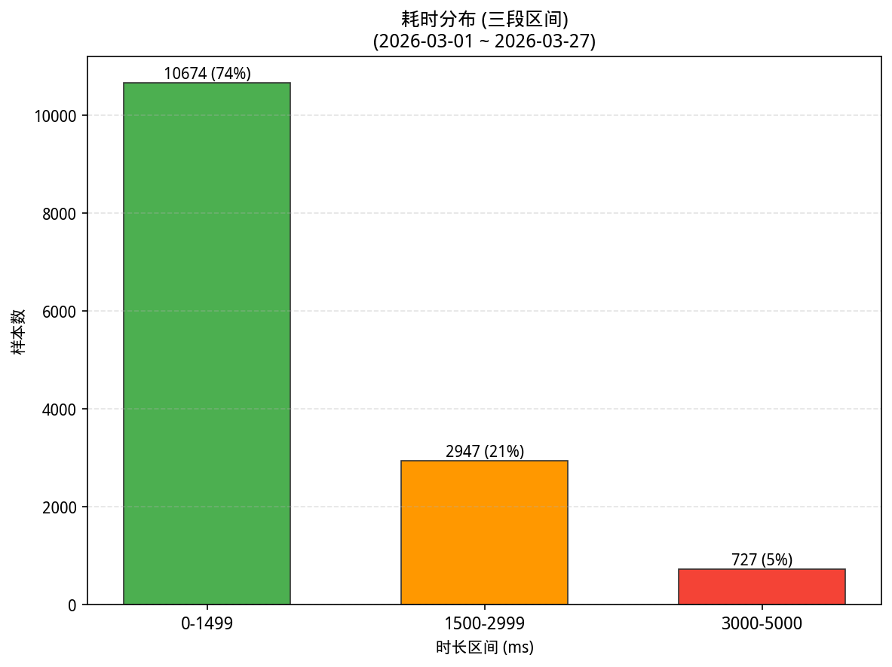
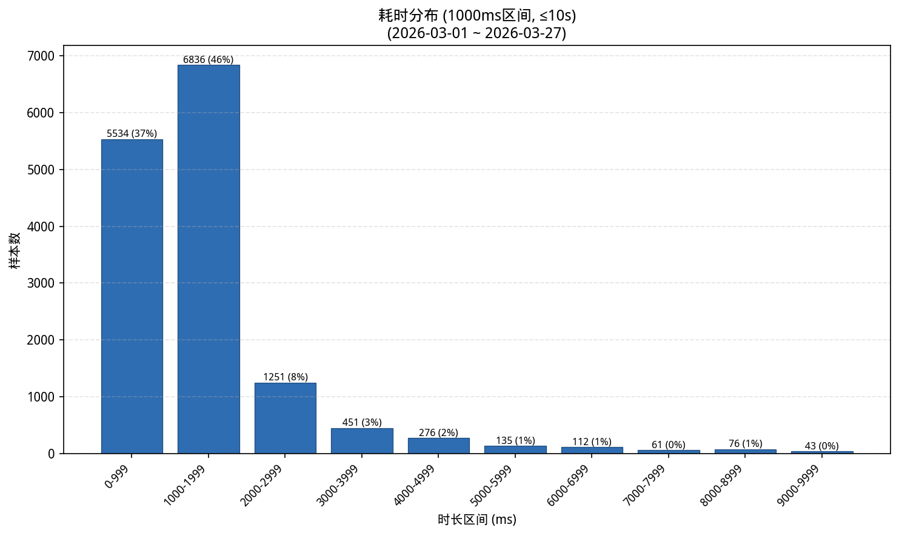
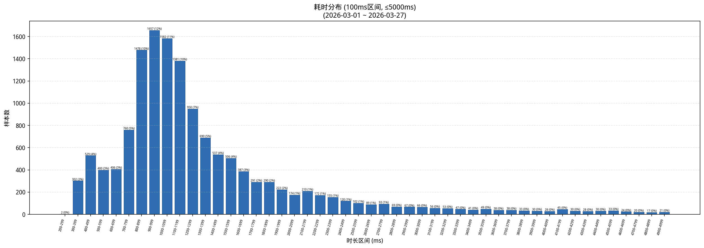

# 自动补全耗时分析报告

## 整体概览

- 样本总数: 14925
- 慢补全阈值: 3000 ms
- 慢补全样本数: 1304 (8.7%)
- 平均耗时: 1698.3 ms
- 中位数耗时 (P50): 1122.0 ms
- P95 耗时: 4303.6 ms
- P99 耗时: 9994.7 ms

## 因素重要性（eta² 效应量，全量数据）

以下基于 **全量数据**（所有时长），非仅慢补全。eta² 使用 log(1 + time) 作为目标变量，比直接比较原始均值更稳健。eta² ∈ [0, 1]，值越大说明该因素对耗时差异的解释力越强（>0.14 大效应，0.06~0.14 中效应，0.01~0.06 小效应）。

| 因素      | eta²  | 最慢分组                     | 样本数 | 分组中位数(ms) |
| --------- | ----- | ---------------------------- | ------ | -------------- |
| username  | 0.177 | weilj                        | 8      | 3554.5         |
| hostname  | 0.177 | CTX-W10-100G035              | 8      | 3554.5         |
| region    | 0.011 | rjy                          | 294    | 1343.5         |
| ide       | 0.004 | unknown                      | 725    | 1132           |
| os        | 0.002 | linux                        | 2666   | 1129.0         |
| modelname | 0.000 | Qwen3-Coder-30B-A3B-Instruct | 14923  | 1122           |

### username

| 分组          | 样本数 | 均值(ms) | 中位数(ms) | P95(ms) |
| ------------- | ------ | -------- | ---------- | ------- |
| weilj         | 8      | 10179.8  | 3554.5     | 27914.3 |
| jiexiao0750   | 1647   | 2489.5   | 1994       | 5795.7  |
| qiuqs0880     | 52     | 2653.7   | 1874.5     | 6491.2  |
| lpzhang       | 162    | 2540.8   | 1846.0     | 7937.8  |
| songyu        | 53     | 2122.4   | 1517       | 5333.0  |
| lizq          | 720    | 1952.4   | 1484.5     | 6245.0  |
| wangyue       | 231    | 5904.1   | 1418       | 35007.0 |
| sunzq0877     | 797    | 1739.7   | 1406       | 3539.4  |
| lingyy        | 686    | 1544.7   | 1355.0     | 3072.2  |
| chenbl        | 31     | 1463.7   | 1348       | 2393.0  |
| fengqi        | 191    | 2371.1   | 1315       | 7115.5  |
| shencq        | 232    | 1476.9   | 1272.5     | 2872.5  |
| yangyz        | 1045   | 1316.4   | 1186       | 2516.0  |
| jugq0907      | 466    | 1988.1   | 1183.5     | 6347.5  |
| zhufq         | 96     | 1399.2   | 1121.5     | 2529.0  |
| administrator | 295    | 1426.9   | 1111       | 2522.6  |
| wangzepeng    | 440    | 1523.5   | 1101.5     | 3240.0  |
| lubin         | 1295   | 1736.9   | 1098       | 5393.2  |
| pda           | 515    | 1124.6   | 1080       | 1657.7  |
| wujy          | 98     | 1478.5   | 1057.0     | 4512.7  |

### hostname

| 分组            | 样本数 | 均值(ms) | 中位数(ms) | P95(ms) |
| --------------- | ------ | -------- | ---------- | ------- |
| CTX-W10-100G035 | 8      | 10179.8  | 3554.5     | 27914.3 |
| CTX-W10-200G074 | 1647   | 2489.5   | 1994       | 5795.7  |
| sh-qiuqs        | 52     | 2653.7   | 1874.5     | 6491.2  |
| CTX-W10-100G120 | 162    | 2540.8   | 1846.0     | 7937.8  |
| CTX-Win-VDI207  | 53     | 2122.4   | 1517       | 5333.0  |
| CTX-W10-100G392 | 720    | 1952.4   | 1484.5     | 6245.0  |
| rjy-td7043      | 231    | 5904.1   | 1418       | 35007.0 |
| CTX-W10-100G373 | 797    | 1739.7   | 1406       | 3539.4  |
| CTX-W10-100G393 | 686    | 1544.7   | 1355.0     | 3072.2  |
| CTX-W10-100G399 | 31     | 1463.7   | 1348       | 2393.0  |
| sh-fengqi       | 191    | 2371.1   | 1315       | 7115.5  |
| CTX-W10-100G288 | 232    | 1476.9   | 1272.5     | 2872.5  |
| CTX-W10-100G282 | 1045   | 1316.4   | 1186       | 2516.0  |
| jn-jugq         | 466    | 1988.1   | 1183.5     | 6347.5  |
| CTX-Win-VDI271  | 96     | 1399.2   | 1121.5     | 2529.0  |
| CHINAMI-4L5I83G | 295    | 1426.9   | 1111       | 2522.6  |
| sh-wangzepeng   | 440    | 1523.5   | 1101.5     | 3240.0  |
| CTX-Win-VDI162  | 1295   | 1736.9   | 1098       | 5393.2  |
| archlinux       | 515    | 1124.6   | 1080       | 1657.7  |
| gz-wujy         | 98     | 1478.5   | 1057.0     | 4512.7  |

### region

| 分组 | 样本数 | 均值(ms) | 中位数(ms) | P95(ms) |
| ---- | ------ | -------- | ---------- | ------- |
| rjy  | 294    | 5229.4   | 1343.5     | 24874.5 |
| sh   | 684    | 1845.8   | 1178.0     | 4856.6  |
| jn   | 13942  | 1616.9   | 1115.0     | 4183.9  |
| bj   | 5      | 764.2    | 729        | 920.2   |

## 数值因素相关性（全量数据）

| 因素                 | 样本数 | Pearson(log_time) | Spearman(time) |
| -------------------- | ------ | ----------------- | -------------- |
| pid_relative_in_host | 14749  | 0.196             | 0.217          |
| user_request_count   | 14925  | -0.119            | -0.112         |
| hourly_bucket_count  | 14925  | -0.067            | -0.079         |
| pid                  | 14925  | 0.045             | 0.062          |

## 耗时分布（全量数据）

| 时长区间(ms)  | 样本数 | 占比  | 累计样本数 | 累计占比 |
| ------------- | ------ | ----- | ---------- | -------- |
| 200-299       | 2      | 0.000 | 2          | 0.000    |
| 300-399       | 302    | 0.020 | 304        | 0.020    |
| 400-499       | 529    | 0.035 | 833        | 0.056    |
| 500-599       | 400    | 0.027 | 1233       | 0.083    |
| 600-699       | 406    | 0.027 | 1639       | 0.110    |
| 700-799       | 760    | 0.051 | 2399       | 0.161    |
| 800-899       | 1478   | 0.099 | 3877       | 0.260    |
| 900-999       | 1657   | 0.111 | 5534       | 0.371    |
| 1000-1099     | 1582   | 0.106 | 7116       | 0.477    |
| 1100-1199     | 1381   | 0.093 | 8497       | 0.569    |
| 1200-1299     | 950    | 0.064 | 9447       | 0.633    |
| 1300-1399     | 690    | 0.046 | 10137      | 0.679    |
| 1400-1499     | 537    | 0.036 | 10674      | 0.715    |
| 1500-1599     | 506    | 0.034 | 11180      | 0.749    |
| 1600-1699     | 387    | 0.026 | 11567      | 0.775    |
| 1700-1799     | 291    | 0.019 | 11858      | 0.795    |
| 1800-1899     | 290    | 0.019 | 12148      | 0.814    |
| 1900-1999     | 222    | 0.015 | 12370      | 0.829    |
| 2000-2099     | 174    | 0.012 | 12544      | 0.840    |
| 2100-2199     | 210    | 0.014 | 12754      | 0.855    |
| 2200-2299     | 172    | 0.012 | 12926      | 0.866    |
| 2300-2399     | 155    | 0.010 | 13081      | 0.876    |
| 2400-2499     | 120    | 0.008 | 13201      | 0.884    |
| 2500-2599     | 102    | 0.007 | 13303      | 0.891    |
| 2600-2699     | 89     | 0.006 | 13392      | 0.897    |
| 2700-2799     | 93     | 0.006 | 13485      | 0.904    |
| 2800-2899     | 69     | 0.005 | 13554      | 0.908    |
| 2900-2999     | 67     | 0.004 | 13621      | 0.913    |
| 3000-3099     | 66     | 0.004 | 13687      | 0.917    |
| 3100-3199     | 56     | 0.004 | 13743      | 0.921    |
| 3200-3299     | 53     | 0.004 | 13796      | 0.924    |
| 3300-3399     | 47     | 0.003 | 13843      | 0.928    |
| 3400-3499     | 41     | 0.003 | 13884      | 0.930    |
| 3500-3599     | 49     | 0.003 | 13933      | 0.934    |
| 3600-3699     | 38     | 0.003 | 13971      | 0.936    |
| 3700-3799     | 38     | 0.003 | 14009      | 0.939    |
| 3800-3899     | 33     | 0.002 | 14042      | 0.941    |
| 3900-3999     | 30     | 0.002 | 14072      | 0.943    |
| 4000-4999     | 276    | 0.018 | 14348      | 0.961    |
| 5000-5999     | 135    | 0.009 | 14483      | 0.970    |
| 6000-6999     | 112    | 0.008 | 14595      | 0.978    |
| 7000-7999     | 61     | 0.004 | 14656      | 0.982    |
| 8000-8999     | 76     | 0.005 | 14732      | 0.987    |
| 9000-9999     | 43     | 0.003 | 14775      | 0.990    |
| 10000-10999   | 20     | 0.001 | 14795      | 0.991    |
| 11000-11999   | 26     | 0.002 | 14821      | 0.993    |
| 12000-12999   | 26     | 0.002 | 14847      | 0.995    |
| 13000-13999   | 6      | 0.000 | 14853      | 0.995    |
| 14000-14999   | 10     | 0.001 | 14863      | 0.996    |
| 15000-15999   | 5      | 0.000 | 14868      | 0.996    |
| 16000-16999   | 2      | 0.000 | 14870      | 0.996    |
| 17000-17999   | 5      | 0.000 | 14875      | 0.997    |
| 18000-18999   | 4      | 0.000 | 14879      | 0.997    |
| 19000-19999   | 2      | 0.000 | 14881      | 0.997    |
| 20000-20999   | 4      | 0.000 | 14885      | 0.997    |
| 22000-22999   | 2      | 0.000 | 14887      | 0.997    |
| 23000-23999   | 1      | 0.000 | 14888      | 0.998    |
| 24000-24999   | 2      | 0.000 | 14890      | 0.998    |
| 25000-25999   | 2      | 0.000 | 14892      | 0.998    |
| 27000-27999   | 1      | 0.000 | 14893      | 0.998    |
| 29000-29999   | 1      | 0.000 | 14894      | 0.998    |
| 30000-30999   | 1      | 0.000 | 14895      | 0.998    |
| 31000-31999   | 1      | 0.000 | 14896      | 0.998    |
| 32000-32999   | 2      | 0.000 | 14898      | 0.998    |
| 33000-33999   | 1      | 0.000 | 14899      | 0.998    |
| 34000-34999   | 2      | 0.000 | 14901      | 0.998    |
| 35000-35999   | 1      | 0.000 | 14902      | 0.998    |
| 36000-36999   | 4      | 0.000 | 14906      | 0.999    |
| 37000-37999   | 1      | 0.000 | 14907      | 0.999    |
| 38000-38999   | 1      | 0.000 | 14908      | 0.999    |
| 39000-39999   | 1      | 0.000 | 14909      | 0.999    |
| 40000-40999   | 1      | 0.000 | 14910      | 0.999    |
| 41000-41999   | 1      | 0.000 | 14911      | 0.999    |
| 45000-45999   | 1      | 0.000 | 14912      | 0.999    |
| 49000-49999   | 1      | 0.000 | 14913      | 0.999    |
| 54000-54999   | 1      | 0.000 | 14914      | 0.999    |
| 55000-55999   | 2      | 0.000 | 14916      | 0.999    |
| 62000-62999   | 1      | 0.000 | 14917      | 0.999    |
| 63000-63999   | 2      | 0.000 | 14919      | 1.000    |
| 74000-74999   | 1      | 0.000 | 14920      | 1.000    |
| 77000-77999   | 1      | 0.000 | 14921      | 1.000    |
| 78000-78999   | 1      | 0.000 | 14922      | 1.000    |
| 80000-80999   | 1      | 0.000 | 14923      | 1.000    |
| 121000-121999 | 1      | 0.000 | 14924      | 1.000    |
| 154000-154999 | 1      | 0.000 | 14925      | 1.000    |

## 慢补全按小时分布（长尾分析，仅慢补全数据）

以下仅统计 **慢补全**（≥3000ms）样本。按一天中的小时 (00:00~23:00) 跨天聚合，用于识别慢请求集中的高峰时段。

| 小时  | 慢补全数 | 慢补全占比 | 均值(ms) | 中位数(ms) |
| ----- | -------- | ---------- | -------- | ---------- |
| 00:00 | 6        | 0.005      | 32125.0  | 21693.0    |
| 04:00 | 10       | 0.008      | 19781.6  | 18934.5    |
| 05:00 | 1        | 0.001      | 4357.0   | 4357       |
| 08:00 | 15       | 0.012      | 20027.5  | 5355       |
| 09:00 | 61       | 0.047      | 6263.4   | 4960       |
| 10:00 | 147      | 0.113      | 6613.0   | 4933       |
| 11:00 | 83       | 0.064      | 8034.0   | 4426       |
| 12:00 | 1        | 0.001      | 5453.0   | 5453       |
| 13:00 | 112      | 0.086      | 7026.0   | 4708.5     |
| 14:00 | 191      | 0.146      | 5633.1   | 4509       |
| 15:00 | 144      | 0.110      | 6366.9   | 4820.0     |
| 16:00 | 214      | 0.164      | 5358.1   | 4559.0     |
| 17:00 | 195      | 0.150      | 5984.1   | 4302       |
| 18:00 | 63       | 0.048      | 7606.8   | 5279       |
| 19:00 | 8        | 0.006      | 7688.0   | 7652.5     |
| 20:00 | 21       | 0.016      | 6690.0   | 6186       |
| 21:00 | 15       | 0.012      | 12630.3  | 4447       |
| 22:00 | 14       | 0.011      | 26616.1  | 16093.0    |
| 23:00 | 3        | 0.002      | 3786.3   | 4035       |

## 按小时整体统计（全量数据）

以下基于 **全量数据**。按一天中的小时 (00:00~23:00) 跨天聚合所有补全请求，分析各时段的请求量和慢补全比例。

| 小时  | 样本数 | 均值(ms) | 中位数(ms) | 慢补全数 | 慢补全率 |
| ----- | ------ | -------- | ---------- | -------- | -------- |
| 00:00 | 53     | 4624.0   | 1071       | 6        | 0.113    |
| 04:00 | 19     | 10933.5  | 5245       | 10       | 0.526    |
| 05:00 | 8      | 1483.1   | 1110.0     | 1        | 0.125    |
| 07:00 | 7      | 1096.3   | 1048       | 0        | 0.000    |
| 08:00 | 171    | 2912.3   | 1256       | 15       | 0.088    |
| 09:00 | 1053   | 1510.7   | 1157       | 61       | 0.058    |
| 10:00 | 1919   | 1550.1   | 1090       | 147      | 0.077    |
| 11:00 | 1001   | 1713.4   | 1072       | 83       | 0.083    |
| 12:00 | 6      | 2099.8   | 1502.5     | 1        | 0.167    |
| 13:00 | 1396   | 1681.3   | 1135.5     | 112      | 0.080    |
| 14:00 | 2187   | 1566.7   | 1113       | 191      | 0.087    |
| 15:00 | 1910   | 1560.2   | 1085.0     | 144      | 0.075    |
| 16:00 | 1948   | 1656.4   | 1129.5     | 214      | 0.110    |
| 17:00 | 1722   | 1813.2   | 1199.0     | 195      | 0.113    |
| 18:00 | 749    | 1814.7   | 1173       | 63       | 0.084    |
| 19:00 | 194    | 1511.2   | 1176.0     | 8        | 0.041    |
| 20:00 | 217    | 1633.2   | 994        | 21       | 0.097    |
| 21:00 | 196    | 2100.5   | 1165.5     | 15       | 0.077    |
| 22:00 | 91     | 5105.9   | 1109       | 14       | 0.154    |
| 23:00 | 76     | 1262.3   | 1124.5     | 3        | 0.039    |

## 慢补全过度出现分析（基于全量数据计算慢率）

以下基于 **全量数据** 计算各组慢率（≥3000ms）。lift = 该组慢率 / 全局基线慢率。lift > 1 表示该组慢补全比例高于平均水平，值越大问题越集中。

### ide

| 分组    | 样本数 | 慢补全数 | 慢补全率 | lift(倍数) |
| ------- | ------ | -------- | -------- | ---------- |
| pycharm | 5568   | 790      | 0.142    | 1.624      |
| vscode  | 8632   | 482      | 0.056    | 0.639      |
| unknown | 725    | 32       | 0.044    | 0.505      |

### os

| 分组    | 样本数 | 慢补全数 | 慢补全率 | lift(倍数) |
| ------- | ------ | -------- | -------- | ---------- |
| linux   | 2666   | 256      | 0.096    | 1.099      |
| windows | 12259  | 1048     | 0.085    | 0.978      |

### region

| 分组 | 样本数 | 慢补全数 | 慢补全率 | lift(倍数) |
| ---- | ------ | -------- | -------- | ---------- |
| rjy  | 294    | 59       | 0.201    | 2.297      |
| sh   | 684    | 67       | 0.098    | 1.121      |
| jn   | 13942  | 1178     | 0.084    | 0.967      |

### username

| 分组        | 样本数 | 慢补全数 | 慢补全率 | lift(倍数) |
| ----------- | ------ | -------- | -------- | ---------- |
| weilj       | 8      | 4        | 0.500    | 5.723      |
| nnikitenko  | 113    | 34       | 0.301    | 3.444      |
| jiexiao0750 | 1647   | 404      | 0.245    | 2.808      |
| qiuqs0880   | 52     | 12       | 0.231    | 2.641      |
| jiaogp0779  | 48     | 11       | 0.229    | 2.623      |
| wangyue     | 231    | 48       | 0.208    | 2.378      |
| lpzhang     | 162    | 32       | 0.198    | 2.261      |
| zhongle     | 63     | 12       | 0.190    | 2.180      |
| fengqi      | 191    | 30       | 0.157    | 1.798      |
| songyu      | 53     | 8        | 0.151    | 1.728      |
| jugq0907    | 466    | 64       | 0.137    | 1.572      |
| lubin       | 1295   | 137      | 0.106    | 1.211      |
| lizq        | 720    | 72       | 0.100    | 1.145      |
| xuexy       | 80     | 8        | 0.100    | 1.145      |
| chenty      | 30     | 3        | 0.100    | 1.145      |
| wujy        | 98     | 8        | 0.082    | 0.934      |
| sunzq0877   | 797    | 61       | 0.077    | 0.876      |
| sunyq       | 603    | 44       | 0.073    | 0.835      |
| chenyang    | 2167   | 144      | 0.066    | 0.761      |
| wangzepeng  | 440    | 25       | 0.057    | 0.650      |

### ide + os

| 分组              | 样本数 | 慢补全数 | 慢补全率 | lift(倍数) |
| ----------------- | ------ | -------- | -------- | ---------- |
| pycharm / linux   | 442    | 93       | 0.210    | 2.408      |
| pycharm / windows | 5126   | 697      | 0.136    | 1.556      |
| vscode / linux    | 1501   | 132      | 0.088    | 1.007      |
| vscode / windows  | 7131   | 350      | 0.049    | 0.562      |
| unknown / linux   | 723    | 31       | 0.043    | 0.491      |

### ide + region

| 分组          | 样本数 | 慢补全数 | 慢补全率 | lift(倍数) |
| ------------- | ------ | -------- | -------- | ---------- |
| pycharm / rjy | 279    | 59       | 0.211    | 2.420      |
| unknown / sh  | 191    | 30       | 0.157    | 1.798      |
| pycharm / jn  | 5289   | 731      | 0.138    | 1.582      |
| vscode / sh   | 493    | 37       | 0.075    | 0.859      |
| vscode / jn   | 8134   | 445      | 0.055    | 0.626      |
| unknown / jn  | 519    | 2        | 0.004    | 0.044      |

## 用户维度汇总（全量数据）

| 用户名      | 样本数 | 占比  | 均值(ms) | 中位数(ms) | P95(ms) | 慢补全率 |
| ----------- | ------ | ----- | -------- | ---------- | ------- | -------- |
| weilj       | 8      | 0.001 | 10179.8  | 3554.5     | 27914.3 | 0.500    |
| nnikitenko  | 113    | 0.008 | 8317.0   | 1044       | 42991.0 | 0.301    |
| jiexiao0750 | 1647   | 0.110 | 2489.5   | 1994       | 5795.7  | 0.245    |
| qiuqs0880   | 52     | 0.003 | 2653.7   | 1874.5     | 6491.2  | 0.231    |
| jiaogp0779  | 48     | 0.003 | 3307.8   | 988.5      | 13926.3 | 0.229    |
| wangyue     | 231    | 0.015 | 5904.1   | 1418       | 35007.0 | 0.208    |
| lpzhang     | 162    | 0.011 | 2540.8   | 1846.0     | 7937.8  | 0.198    |
| zhongle     | 63     | 0.004 | 2182.1   | 884        | 9507.1  | 0.190    |
| fengqi      | 191    | 0.013 | 2371.1   | 1315       | 7115.5  | 0.157    |
| songyu      | 53     | 0.004 | 2122.4   | 1517       | 5333.0  | 0.151    |
| jugq0907    | 466    | 0.031 | 1988.1   | 1183.5     | 6347.5  | 0.137    |
| lubin       | 1295   | 0.087 | 1736.9   | 1098       | 5393.2  | 0.106    |
| chenty      | 30     | 0.002 | 1978.9   | 973.0      | 5084.9  | 0.100    |
| lizq        | 720    | 0.048 | 1952.4   | 1484.5     | 6245.0  | 0.100    |
| xuexy       | 80     | 0.005 | 1595.6   | 816.5      | 4449.4  | 0.100    |
| wujy        | 98     | 0.007 | 1478.5   | 1057.0     | 4512.7  | 0.082    |
| sunzq0877   | 797    | 0.053 | 1739.7   | 1406       | 3539.4  | 0.077    |
| sunyq       | 603    | 0.040 | 1373.3   | 940        | 4070.5  | 0.073    |
| chenyang    | 2167   | 0.145 | 1199.6   | 830        | 3943.8  | 0.066    |
| wangzepeng  | 440    | 0.029 | 1523.5   | 1101.5     | 3240.0  | 0.057    |

## 频率-时长关联分析（全量数据）

以下基于 **全量数据**。Spearman 相关系数衡量请求频率与耗时/慢率的单调关联。正值表示高频时段（或用户）倾向更慢，可能存在负载瓶颈。仅为关联，不代表因果。

| 范围   | 桶数 | Spearman(频率,均值) | Spearman(频率,慢率) |
| ------ | ---- | ------------------- | ------------------- |
| 小时桶 | 269  | 0.117               | 0.309               |

| 范围 | 用户组数 | Spearman(频率,均值) | Spearman(频率,慢率) |
| ---- | -------- | ------------------- | ------------------- |
| 用户 | 34       | -0.043              | -0.033              |

## 最慢样本明细（全量数据 Top 20）

| 时间戳                     | 用户名     | 主机名          | IDE     | 操作系统 | 地域 | PID   | 耗时(ms) |
| -------------------------- | ---------- | --------------- | ------- | -------- | ---- | ----- | -------- |
| 2026-03-23T13:32:11.829516 | wangyue    | rjy-td7043      | pycharm | linux    | rjy  | 41916 | 154342   |
| 2026-03-26T22:30:48.221610 | nnikitenko | jn-ru16         | pycharm | linux    | jn   | 32190 | 121803   |
| 2026-03-26T00:19:54.723436 | nnikitenko | jn-ru16         | pycharm | linux    | jn   | 32190 | 80010    |
| 2026-03-18T08:56:52.402038 | wangyue    | rjy-td7043      | pycharm | linux    | rjy  | 22065 | 78854    |
| 2026-03-19T11:12:38.456766 | wangyue    | rjy-td7043      | pycharm | linux    | rjy  | 22065 | 77034    |
| 2026-03-23T11:17:24.632092 | wangyue    | rjy-td7043      | pycharm | linux    | rjy  | 41916 | 74369    |
| 2026-03-24T08:49:53.360254 | wangyue    | rjy-td7043      | pycharm | linux    | rjy  | 49525 | 63976    |
| 2026-03-24T08:12:41.401713 | wangyue    | rjy-td7043      | pycharm | linux    | rjy  | 49525 | 63901    |
| 2026-03-26T00:12:22.479857 | nnikitenko | jn-ru16         | pycharm | linux    | jn   | 32190 | 62447    |
| 2026-03-16T17:13:20.521615 | lubin      | CTX-Win-VDI162  | pycharm | windows  | jn   | 14804 | 55781    |
| 2026-03-27T04:21:08.111162 | nnikitenko | jn-ru16         | pycharm | linux    | jn   | 32190 | 55625    |
| 2026-03-25T21:58:20.040705 | nnikitenko | jn-ru16         | pycharm | linux    | jn   | 32190 | 54672    |
| 2026-03-10T15:16:34.947003 | fengqi     | sh-fengqi       | unknown | linux    | sh   | 16614 | 49000    |
| 2026-03-26T22:14:09.290455 | nnikitenko | jn-ru16         | pycharm | linux    | jn   | 32190 | 45268    |
| 2026-03-26T22:08:28.588580 | nnikitenko | jn-ru16         | pycharm | linux    | jn   | 32190 | 41473    |
| 2026-03-23T17:29:17.158674 | wangyue    | rjy-td7043      | pycharm | linux    | rjy  | 2504  | 40586    |
| 2026-03-23T18:05:16.625348 | wangyue    | rjy-td7043      | pycharm | linux    | rjy  | 2504  | 39536    |
| 2026-03-23T10:54:22.141071 | wangyue    | rjy-td7043      | pycharm | linux    | rjy  | 41916 | 38358    |
| 2026-03-23T10:45:54.779037 | wangyue    | rjy-td7043      | pycharm | linux    | rjy  | 41916 | 37409    |
| 2026-03-11T14:57:39.604979 | lizq       | CTX-W10-100G392 | vscode  | windows  | jn   | 804   | 36527    |

## 说明

- 只分析 time 字段（补全总耗时），其他 debug_ms 字段不参与任何结论。
- 慢补全 / 长尾的阈值统一为 ≥3000ms。
- region 通过 hostname 是否包含 bj、jn、sh、rjy 判断；若都不包含，默认记为 jn。
- hostname 中按分隔符边界匹配 win、w10、w11（大小写不敏感）判为 windows，其余统一判为 linux。
- 按小时统计均为跨天聚合（按一天中的 0~23 时），用于识别高峰时段而非具体日期。
- PID 绝对值跨机器不可直接比较，脚本额外计算了 pid_relative_in_host（同主机内归一化到 [0,1]），用于观察进程生命周期与耗时的关系。
- 频率-时长关联仅表示统计关联，不代表因果。若要做因果分析，需额外控制用户、主机、时间段等混杂因素。
